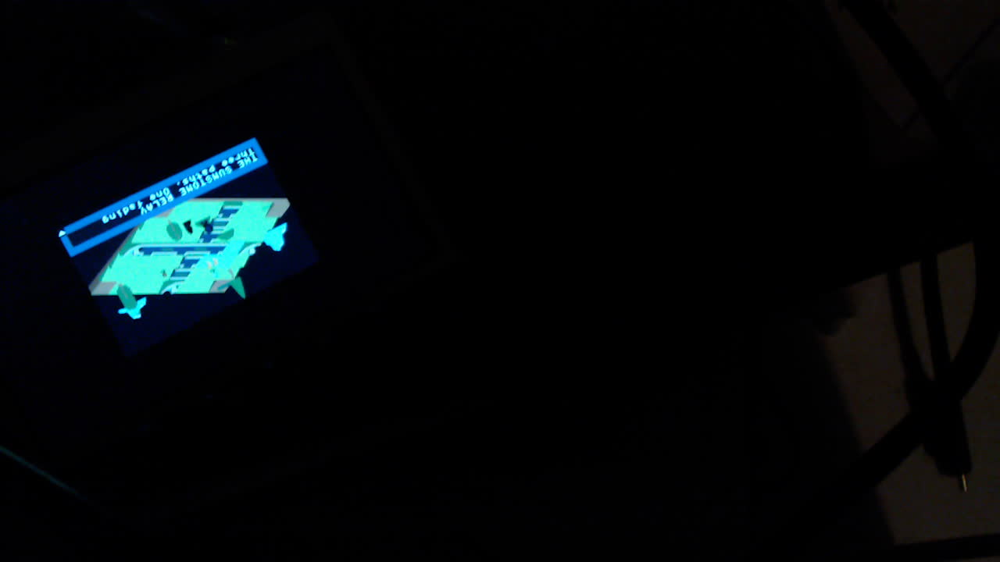
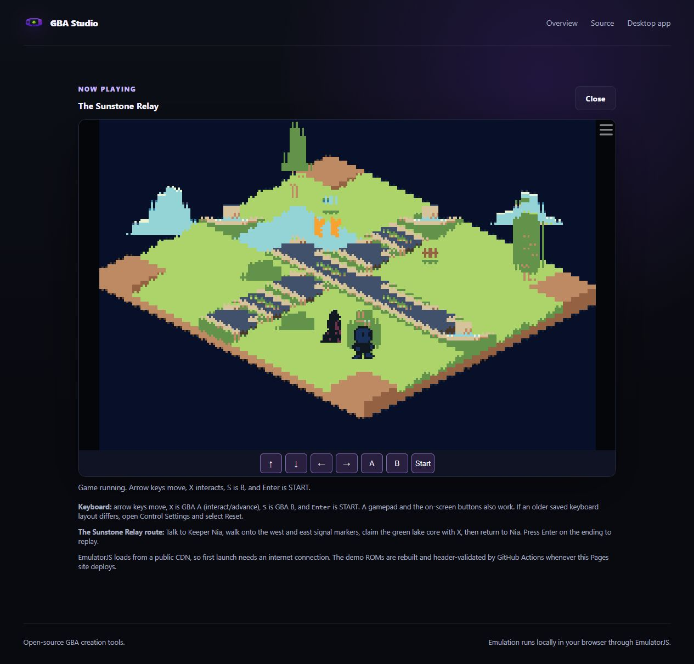
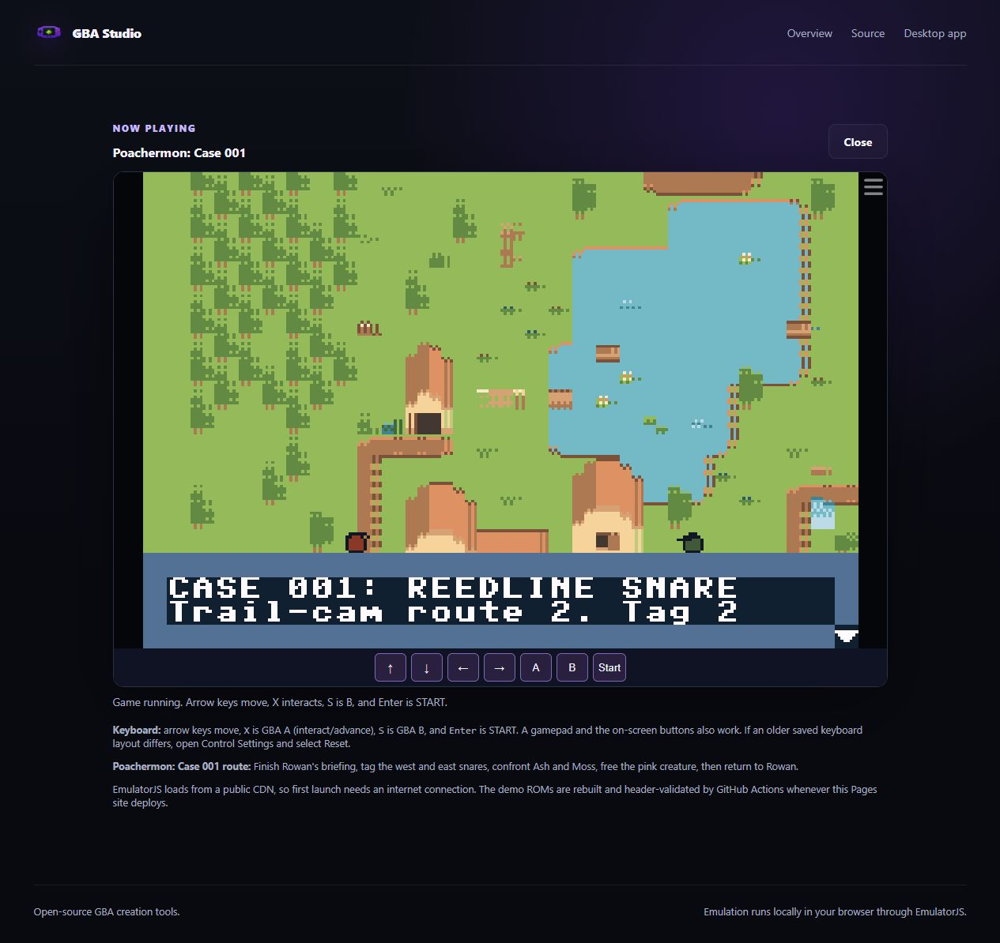
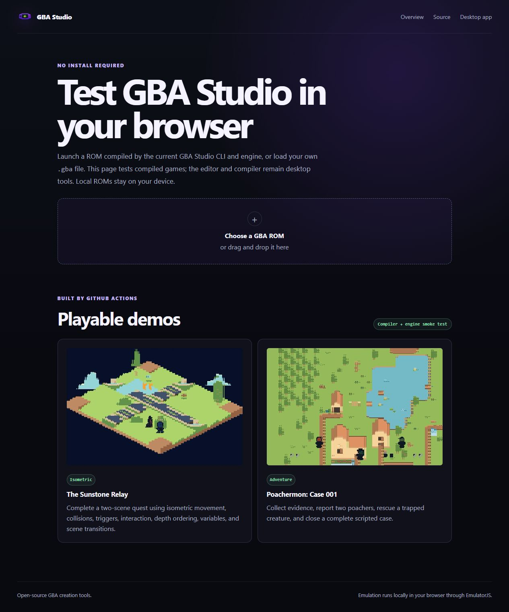
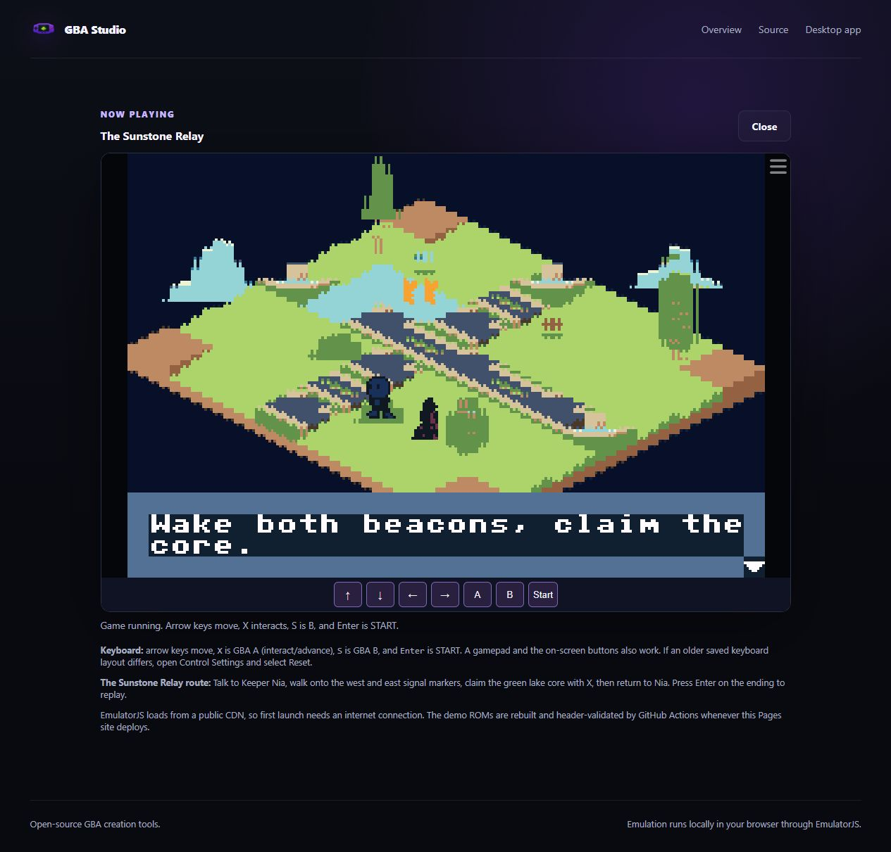
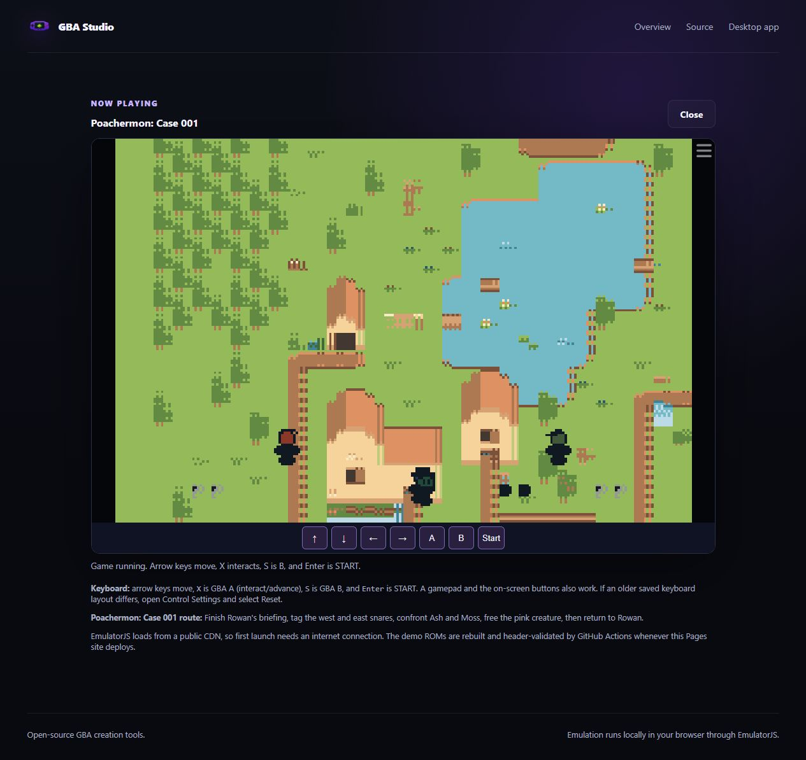
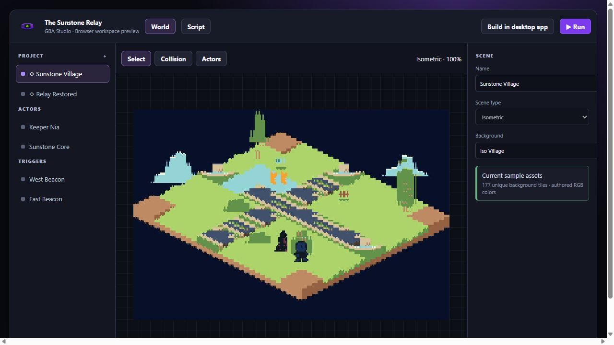

# Studio, browser and handheld validation

Updated 1 October 2026 for Studio 4.4.9 and engine `4e780bb`.

## Desktop flow

The Handheld button uses the open editor project, including unsaved changes
already held in editor state. It exports native scene data and compiles
`build/tang/firmware/game.tang.bin` with LLVM. It offers three separate actions:

- **Build game**: compile firmware without connecting hardware.
- **Build + load game**: compile, upload over USB UART and read the hardware report.
- **Flash FPGA + load**: program `studio_lcd`, then upload and check the game.

The panel requires a serial port and FPGA checkout for hardware actions,
disables actions while busy, displays errors and streams build/programmer logs.
SRAM programming is selected initially. Unchecking it writes FPGA flash.
Game firmware is held in SDRAM and must be loaded again after power-off.

The final Windows 4.4.9 Squirrel installer was built and installed after more
disk space became available. Setup exited with code 0; the installed executable
and Windows uninstall entry both report 4.4.9. The installed app archive SHA256
matches the packaged build. The owner confirmed that the installed editor
opened Sunstone Relay.

The installed archive's compiler worker was extracted and run against Sunstone,
then its bundled engine was compiled with LLVM. Both steps succeeded and produced
the same 35,536-byte firmware and SHA256 as the prior hardware check. This checks
the distributed compiler and engine; it does not exercise Electron's worker
startup inside the archive or the native Handheld button click.

The resulting firmware was then programmed and uploaded through Gowin and
COM5: programming passed, CRC `ee54d55f` was verified, and the board reported
28.915 fps with no CPU fault. [Windows installation and hardware results](reports/windows-local-e2e-2026-10-01.json)
record the individual phases and package hashes. The native Handheld action
is awaiting an owner-operated check because desktop automation cannot start.
No fresh webcam check was possible: DirectShow could not enumerate video devices.

React tests exercise configuration,
required fields, current-project submission, errors and success messages;
command tests check literal arguments and failed subprocesses. The full
source-build/program/upload/report command was exercised on the real board.
Native editor clicking was not verified: the Windows desktop-control helper
could not initialize. macOS and Linux use the same Python subprocess flow;
hardware execution was tested on Windows only.

## Hardware results

Gowin V1.9.12.04, USB cable type 4/location 289, COM5, Tang Nano 20K,
4.3-inch 480x272 RGB LCD. Both games use a centred 240x160 game viewport.

| Game | Firmware | CRC32 | Measured update rate | CPU fault |
|---|---:|---|---:|---|
| Sunstone Relay | 35,536 bytes | `ee54d55f` | 28.915 fps | false |
| Poachermon | 34,096 bytes | `d2265165` | 28.928 fps | false |

Measurements cover approximately five seconds of frame-counter increments,
not worst-case gameplay. [Structured results](reports/handheld-2026-10-01.json)
include SHA256 hashes, transfer results and debug addresses. The current
Sunstone game is also copied into the local FPGA project's `game/` directory.
Generated firmware and ROMs are not committed.

The webcam confirms scene and dialogue output. Its exposure and viewing angle
do not establish calibrated colors, supply voltage or power consumption.

## Browser and assets

Both published demos are rebuilt from their source projects. Background art
uses a cohesive limited palette shared with each desktop template. The GBA
compiler preserves authored RGB555 colors for auto-color backgrounds that
fit one 16-color bank; larger/manual palettes retain the existing path.
Packing tests reconstruct the original colors from the generated 4bpp tiles.
The art budget validator reports 177 unique tiles for Sunstone and 86 for
Poachermon, within the 180-tile budget.

The browser checks exercised boot, dialogue advance and movement in both
games. They did not replay both quests through every ending. The player has
keyboard, gamepad and on-screen controls; dialogue letters now have an opaque
fill, and sprites remain behind the dialogue layer. The Storybook workspace
preview's Run button launches the compiled Sunstone ROM. Building and flashing
remain desktop actions.

The app icons, project icons, splash and web branding use the landscape
handheld logo. Its raster master and [generation prompt](art-direction/handheld-logo-prompt.txt)
are included; the final icon formats are generated from that master.

The player pins EmulatorJS 4.2.3. Input bindings and on-screen buttons follow
the upstream [control mapping](https://emulatorjs.org/docs4devs/control-mapping/)
and [input implementation](https://github.com/EmulatorJS/EmulatorJS/blob/v4.2.3/data/src/GameManager.js).

## Published checks

The current [browser player](https://eoinjordan.github.io/GBA-Studio/player/)
and workspace preview were deployed from commit `992d8a093`. Studio CI,
the Pages build, the engine tests and FPGA Windows/Linux/macOS checks passed.
Both public games were checked again for dialogue and movement after deployment.

The workspace image shows the browser preview, not the native editor.
